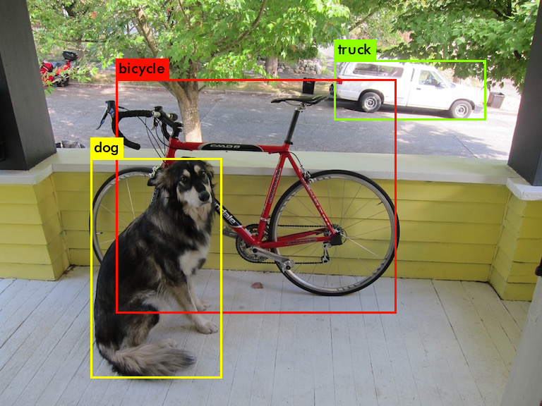

# Introduction of Darknet

Darknet is an open source neural network framework written in C and CUDA by Joseph Chet Redmon. It is fast, easy to install, and supports CPU and GPU computation.

For more information see the [Darknet project website](http://pjreddie.com/darknet).
For questions or issues please use the [Google Group](https://groups.google.com/forum/#!forum/darknet).

This repo is forked from [pjreddie/darknet.git](https://github.com/pjreddie/darknet.git) for my personal practice. I made a few changes with repect to testing and implementations. If you are looking for the source files, please to the [https://pjreddie.com/](https://pjreddie.com/) for details.

# File Structure:

    .
    ├── License
    ├── Makefile
    ├── README.md
    ├── cfg
    ├── darknet
    ├── data
    ├── examples
    ├── include
    ├── libdarknet.a
    ├── libdarknet.so
    ├── models
    ├── obj
    ├── predictions.png
    ├── python
    ├── results
    ├── run_test_dog.sh
    ├── scripts
    └── src

## Install Darknet

First clone the Darknet git repository [here](https://github.com/cuicaihao/darknet.git). This can be accomplished by:

```bash
git clone https://github.com/cuicaihao/darknet.git
cd darknet
make
```

If this works you should see a whole bunch of compiling information flying. There will be extra file created in your folder:

- obj/ \*.o
- darknet
- libdarknet.a
- libdarknet.so

If everything seems to have compiled correctly, try running it!

```bash
./darknet
```

You should get the output:

```bash
usage: ./darknet <function>
```

## Download the model weights

You already have the config file for YOLO in the cfg/ subdirectory. You will have to download the pre-trained weight file here (237 MB). Or just run this:

```bash
cd models
wget https://pjreddie.com/media/files/yolov3.weights
```

## Run test images

Then run the detector!
./darknet detect cfg/yolov3.cfg yolov3.weights data/dog.jpg

```bash
# go back the darknet root folder
./darknet detect cfg/yolov3.cfg models/yolov3.weights data/dog.jpg
```

You will see some output like this:

```bash
layer     filters    size              input                output
    0 conv     32  3 x 3 / 1   416 x 416 x   3   ->   416 x 416 x  32  0.299 BFLOPs
    1 conv     64  3 x 3 / 2   416 x 416 x  32   ->   208 x 208 x  64  1.595 BFLOPs
    2 conv     32  1 x 1 / 1   208 x 208 x  64   ->   208 x 208 x  32  0.177 BFLOPs
    3 conv     64  3 x 3 / 1   208 x 208 x  32   ->   208 x 208 x  64  1.595 BFLOPs
    4 res    1                 208 x 208 x  64   ->   208 x 208 x  64
    5 conv    128  3 x 3 / 2   208 x 208 x  64   ->   104 x 104 x 128  1.595 BFLOPs
   ........
   99 conv    128  1 x 1 / 1    52 x  52 x 384   ->    52 x  52 x 128  0.266 BFLOPs
  100 conv    256  3 x 3 / 1    52 x  52 x 128   ->    52 x  52 x 256  1.595 BFLOPs
  101 conv    128  1 x 1 / 1    52 x  52 x 256   ->    52 x  52 x 128  0.177 BFLOPs
  102 conv    256  3 x 3 / 1    52 x  52 x 128   ->    52 x  52 x 256  1.595 BFLOPs
  103 conv    128  1 x 1 / 1    52 x  52 x 256   ->    52 x  52 x 128  0.177 BFLOPs
  104 conv    256  3 x 3 / 1    52 x  52 x 128   ->    52 x  52 x 256  1.595 BFLOPs
  105 conv    255  1 x 1 / 1    52 x  52 x 256   ->    52 x  52 x 255  0.353 BFLOPs
  106 detection
Loading weights from models/yolov3.weights...Done!
data/dog.jpg: Predicted in 8.608562 seconds.
truck: 92%
bicycle: 99%
dog: 99%
```

You will find a `predictions.png` image with bounding boxes of a dog, a bicycle and truck in the current folder.



## Compiling with CUDA

Darknet on the CPU is fast but it's like 500 times faster on GPU! You'll have to have an Nvidia GPU and you'll have to install CUDA. I won't go into CUDA installation in detail because it is terrifying.

Once you have CUDA installed, change the first line of the `Makefile` in the base directory to read:

```bash
GPU=1
```

Now you can `make` the project and CUDA will be enabled. By default it will run the network on the 0th graphics card in your system (if you installed CUDA correctly you can list your graphics cards using `nvidia-smi`). If you want to change what card Darknet uses you can give it the optional command line flag `-i <index>`, like:

```bash
./darknet -i 1 imagenet test cfg/alexnet.cfg alexnet.weights
```

If you compiled using CUDA but want to do CPU computation for whatever reason you can use -nogpu to use the CPU instead:

```bash
./darknet -nogpu imagenet test cfg/alexnet.cfg alexnet.weights
```

### Compiling With OpenCV

By default, Darknet uses `stb_image.h` for image loading. If you want more support for weird formats (like CMYK jpegs, thanks Obama) you can use [OpenCV](https://opencv.org/) instead! OpenCV also allows you to view images and detections without having to save them to disk.

First install OpenCV. If you do this from source it will be long and complex so try to get a package manager to do it for you.

Next, change the 2nd line of the `Makefile` to read:

```bash
OPENCV=1
```

You're done! To try it out, first re-make the project. Then use the imtest routine to test image loading and displaying:

```bash
./darknet imtest data/eagle.jpg
```

Please visit [https://pjreddie.com/darknet/](https://pjreddie.com/darknet/) for more details and updates.
